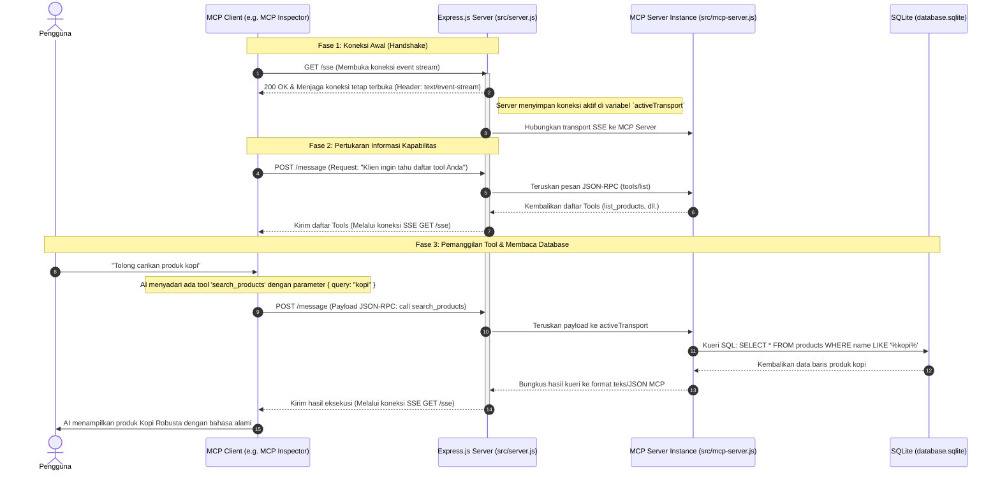

# Panduan Lengkap: Bagaimana MCP Bekerja di Proyek Ini

Dokumen ini menjelaskan secara detail alur kerja **Model Context Protocol (MCP)** pada proyek ini, mulai dari koneksi awal hingga AI berhasil membaca data dari database SQLite. Panduan ini dirancang khusus untuk pemula yang baru pertama kali mengembangkan MCP.

---

## 1. Konsep Dasar Arsitektur MCP

Model Context Protocol (MCP) adalah protokol standar terbuka yang memungkinkan aplikasi AI (seperti Claude Desktop, Cursor, atau MCP Inspector) untuk berinteraksi dengan sumber data atau alat bantu eksternal secara aman dan terstruktur.

Ada tiga peran utama dalam ekosistem MCP:
1. **AI Host / Client**: Aplikasi tempat pengguna berinteraksi dengan AI (contoh: Claude Desktop, Cursor, atau alat penguji seperti MCP Inspector).
2. **MCP Server**: Program backend kita (Express.js + SQLite) yang menyediakan data, alat (tools), atau dokumen (resources).
3. **Database / Data Source**: Penyimpanan data aktual (file `database.sqlite` di lokal).

Di proyek ini, komunikasi antara **Client** dan **Server** menggunakan transport **SSE (Server-Sent Events)** melalui protokol HTTP.

---

## 2. Diagram Alur Komunikasi (Sequence Diagram)

Berikut adalah diagram urutan bagaimana proses koneksi terjadi hingga AI berhasil memanggil fungsi (tool) untuk membaca database SQLite:



---

## 3. Penjelasan Detail Setiap Langkah

### Langkah 1: Membuka Koneksi (GET `/sse`)
Klien MCP (misalnya MCP Inspector) mengirimkan request HTTP GET ke endpoint `http://localhost:3000/sse`. 
* **Apa yang dilakukan Express?** Express tidak langsung menutup koneksi ini. Express mengirimkan header `Content-Type: text/event-stream` yang memberitahu browser/klien untuk menjaga koneksi tetap terbuka. Koneksi searah ini digunakan server untuk mengirimkan data ke klien secara real-time.
* **Kode Terkait (`src/server.js`):**
  ```javascript
  app.get('/sse', async (req, res) => {
    // Membuat transport baru dan memberitahu klien agar mengirim pesan POST ke '/message'
    activeTransport = new SSEServerTransport('/message', res);
    // Menghubungkan transport ke mesin server MCP
    await mcpServer.connect(activeTransport);
  });
  ```

### Langkah 2: Pertukaran Kapabilitas
Setelah koneksi SSE terbuka, Klien mengirim pesan (request) ke server untuk menanyakan: *"Alat (tools) apa saja yang Anda miliki?"*. 
Pesan ini dikirim dalam format JSON-RPC melalui HTTP POST ke `/message`. Server MCP merespons dengan daftar alat yang sudah kita daftarkan di `src/mcp-server.js`.
* **Daftar Alat (Tools) yang kita daftarkan:**
  1. `list_products` (Melihat semua produk)
  2. `search_products` (Mencari produk berdasarkan teks)
  3. `get_product` (Melihat detail produk berdasarkan ID)
  4. `get_customer_orders` (Melihat riwayat pesanan pelanggan)

### Langkah 3: Pengguna Mengajukan Pertanyaan & AI Memilih Alat
Saat pengguna mengetik di chat: *"Tampilkan riwayat pesanan milik pelanggan ID 2"*.
1. Model AI menganalisis kalimat tersebut.
2. AI mendeteksi kecocokan dengan deskripsi tool `get_customer_orders` yang membutuhkan argumen `customerId: 2`.
3. Klien MCP mengirimkan request HTTP POST ke `http://localhost:3000/message` dengan payload JSON-RPC seperti ini:
   ```json
   {
     "jsonrpc": "2.0",
     "method": "tools/call",
     "params": {
       "name": "get_customer_orders",
       "arguments": {
         "customerId": 2
       }
     },
     "id": 1
   }
   ```

### Langkah 4: Eksekusi Query di Server & SQLite
1. Endpoint `POST /message` di Express menerima payload di atas.
2. Express memanggil `activeTransport.handlePostMessage(req, res)` untuk memasukkan pesan tersebut ke mesin SDK MCP.
3. SDK MCP mencocokkan nama tool (`get_customer_orders`) dan menjalankan fungsi handler yang didefinisikan di `src/mcp-server.js`.
4. Kode kita membuka koneksi SQLite (`getDb()`) dan menjalankan query SQL JOIN untuk mengambil data pesanan pelanggan nomor 2.
* **Kode Terkait (`src/mcp-server.js`):**
  ```javascript
  case 'get_customer_orders': {
    const query = `
      SELECT o.id as order_id, o.quantity, o.order_date,
             p.name as product_name, p.price as product_price, p.category as product_category
      FROM orders o
      JOIN products p ON o.product_id = p.id
      WHERE o.customer_id = ?
    `;
    const orders = await db.all(query, [args.customerId]);
    return {
      content: [
        {
          type: 'text',
          text: JSON.stringify(orders, null, 2),
        },
      ],
    };
  }
  ```

### Langkah 5: Mengirimkan Kembali Hasil ke Klien
Setelah data hasil query SQL didapatkan, server MCP mengonversinya menjadi string JSON dan mengembalikannya ke klien. 
Karena protokol ini menggunakan SSE, respons dikirimkan kembali ke klien melalui **koneksi GET `/sse` yang tetap terbuka tadi**, bukan sebagai balasan langsung dari request POST `/message`.

AI membaca data mentah tersebut, memformatnya dengan bahasa alami yang ramah, lalu menampilkannya kepada pengguna: *"Berikut adalah daftar pesanan untuk pelanggan ID 2: ..."*.

---

## 4. Rangkuman Singkat

* **Express.js** bertindak sebagai **satpam / kurir** yang mengelola lalu lintas koneksi web HTTP dan SSE.
* **MCP SDK** bertindak sebagai **penerjemah** yang mengubah request web dari AI menjadi fungsi JavaScript terstruktur.
* **SQLite** bertindak sebagai **gudang data** tempat semua informasi produk, pelanggan, dan pesanan disimpan.
