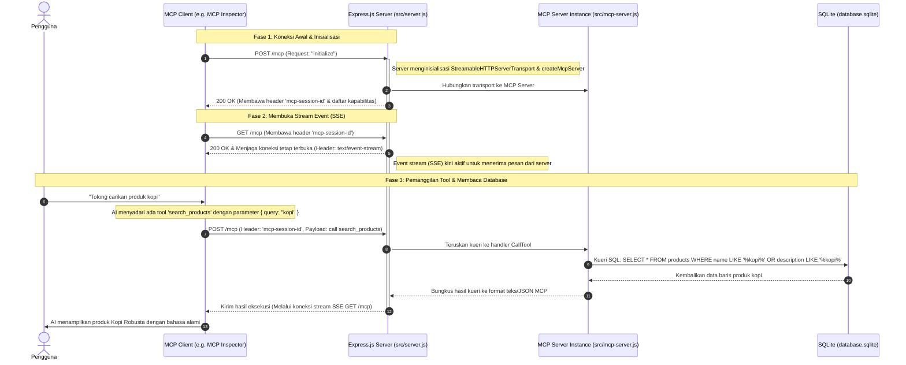

# Panduan Lengkap: Bagaimana MCP Bekerja di Proyek Ini

Dokumen ini menjelaskan secara detail alur kerja **Model Context Protocol (MCP)** pada proyek ini, mulai dari koneksi awal hingga AI berhasil membaca data dari database SQLite. Panduan ini dirancang khusus untuk pemula yang baru pertama kali mengembangkan MCP.

---

## 1. Konsep Dasar Arsitektur MCP

Model Context Protocol (MCP) adalah protokol standar terbuka yang memungkinkan aplikasi AI (seperti Claude Desktop, Cursor, atau MCP Inspector) untuk berinteraksi dengan sumber data atau alat bantu eksternal secara aman dan terstruktur.

Ada tiga peran utama dalam ekosistem MCP:
1. **AI Host / Client**: Aplikasi tempat pengguna berinteraksi dengan AI (contoh: Claude Desktop, Cursor, atau alat penguji seperti MCP Inspector).
2. **MCP Server**: Program backend kita (Express.js + SQLite) yang menyediakan data, alat (tools), atau dokumen (resources).
3. **Database / Data Source**: Penyimpanan data aktual (file `database.sqlite` di lokal).

Di proyek ini, komunikasi antara **Client** dan **Server** menggunakan transport **Streamable HTTP (SSE)** melalui protokol HTTP yang dinaungi oleh `StreamableHTTPServerTransport` dari SDK MCP resmi.

---

## 2. Diagram Alur Komunikasi (Sequence Diagram)

Berikut adalah diagram urutan bagaimana proses koneksi terjadi hingga AI berhasil memanggil fungsi (tool) untuk membaca database SQLite melalui endpoint tunggal `/mcp`:



---

## 3. Penjelasan Detail Setiap Langkah

### Langkah 1: Inisialisasi Sesi (POST `/mcp`)
Pertama kali klien terhubung, klien mengirimkan permintaan `initialize` melalui HTTP POST ke `/mcp` tanpa menyertakan Session ID.
* **Apa yang dilakukan Express?** Express menangkap request ini. Karena belum ada Session ID, server menginisialisasi instance `StreamableHTTPServerTransport` baru dan membuat instance `createMcpServer()` terisolasi untuk sesi tersebut. Server menghasilkan `mcp-session-id` unik (menggunakan UUID) dan mengembalikannya ke klien bersama respons inisialisasi.
* **Kode Terkait (`src/server.js`):**
  ```javascript
  transport = new StreamableHTTPServerTransport({
      sessionIdGenerator: () => randomUUID(),
      onsessioninitialized: (id) => {
          transports.set(id, transport);
      }
  });
  const server = createMcpServer();
  await server.connect(transport);
  ```

### Langkah 2: Membuka Koneksi Stream (GET `/mcp`)
Setelah mendapatkan `mcp-session-id`, klien langsung mengirimkan request HTTP GET ke endpoint `/mcp` dengan menyertakan header `mcp-session-id`.
* **Membuka SSE (Server-Sent Events)**: Transport menangkap request ini dan merespons dengan header `Content-Type: text/event-stream`. Koneksi ini dijaga tetap terbuka (*keep-alive*). Ini adalah jalur pipa searah dari server ke klien untuk mengirimkan event/notification dan jawaban atas pemanggilan tool.

### Langkah 3: Pengguna Mengajukan Pertanyaan & AI Memilih Alat
Saat pengguna mengetik di chat: *"Cari kopi"*.
1. Model AI menganalisis kalimat tersebut dan mencocokkannya dengan deskripsi tool `search_products`.
2. Klien MCP mengirimkan request HTTP POST ke `/mcp` dengan membawa header `mcp-session-id` berisi payload JSON-RPC:
   ```json
   {
     "jsonrpc": "2.0",
     "method": "tools/call",
     "params": {
       "name": "search_products",
       "arguments": {
         "query": "kopi"
       }
     },
     "id": 2
   }
   ```

### Langkah 4: Eksekusi Query di Server & SQLite
1. Endpoint `/mcp` di Express menerima payload POST di atas.
2. Express mencari objek transport yang cocok di Map `transports` berdasarkan `mcp-session-id` di header, lalu memanggil `transport.handleRequest(req, res, req.body)`.
3. Transport meneruskan pesan tersebut ke handler `CallToolRequestSchema` yang didefinisikan di `src/mcp-server.js`.
4. Kode kita membuka koneksi SQLite (`getDb()`) dan menjalankan query SQL.

### Langkah 5: Mengirimkan Kembali Hasil ke Klien via SSE
Setelah data hasil query SQL didapatkan, server MCP mengonversinya menjadi format MCP JSON dan mengirimkannya kembali ke klien melalui koneksi **GET `/mcp` (SSE stream)** yang dibuka pada Langkah 2.
AI membaca data mentah tersebut, memformatnya dengan bahasa alami yang ramah, lalu menampilkannya kepada pengguna.

---

## 4. Rangkuman Singkat

* **StreamableHTTPServerTransport** adalah standar baru yang menggantikan `SSEServerTransport` yang deprecated.
* **Unified Endpoint (`/mcp`)** menangani GET, POST, dan DELETE sekaligus untuk manajemen sesi dan pengiriman pesan.
* **createMcpServer()** (Factory Pattern) digunakan untuk membuat server baru per sesi agar tidak terjadi kebocoran data antar pengguna.
